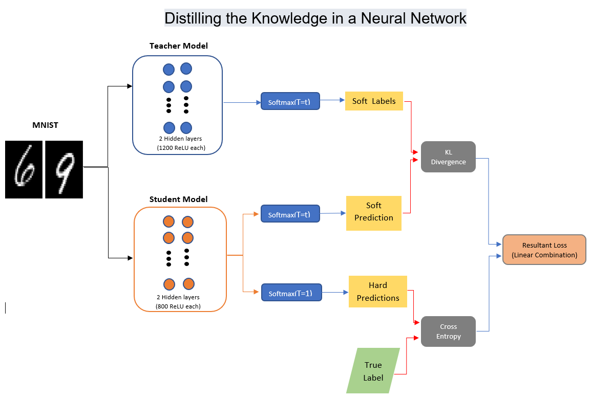

# The Reproduction of “Distilling the Knowledge in a Neural Network”


## Introduction

Neural networks are a widespread phenomenon now with numerous variants which have been devised in the recent years. They are part of the deep learning research field which is growing at a rapid rate with lots of research being published every year. However, one downside to this sometimes is that the newly developed model tends to be quite large in size and require huge amounts of computation power to run. This is of course not an issue in a research setting where, usually, there is enough computation power available. Once we start looking at production environments, this does indeed become an issue.

In production environments the networks need to run reliably and fast in the case there are time constraints. Furthermore, the systems used in production environments are usually a bit slower than the large workstations or even gpu servers used in research. Therefor running large, elaborate, models on limited hardware is not always possible. The best solution would be to take some of the knowledge gained by the large models in research settings and transferring that knowledge to simpler models that can run on more limited hardware in those production environments. The transfer of this knowledge can be seen as so called "knowledge distillation" of teacher models into student models.

There has been some research into this topic of knowledge distilation in the form of [1]. The aim of this project was to reproduce results from section 3 of [1]. In addition, we compared the efficiency of the Feed Forward Network (FFN) used by the authors with that of a Convolutional Neural Network (CNN). This CNN was created by ourselves in an extra effort to try and outperform the original results.

Thus, distillation is a technique aiming to transfer the knowledge acquired by a cumbersome model (teacher) to a simpler one (student): very complex models could be computationally expensive to deploy in a production environment, hence the advantage of having a smaller and lighter model with the same knowledge.

We will start by describing how we structured our teacher and student models and how did we train the latter to mimic the former. Then we will describe our experiments and results, comparing these to the authors achievements.

## Methodology

In this section we will first describe the workings of the knowledge distillation for the Feed Forward Network used to reproduce the original results. Later on in this section the CNN model will be described.

### Feed Forward Network Knowledge Distillation

As we said, we aim to distilling the knowledge of a complex model (teacher) into a simpler one (student).

We jittered the images from the MNIST dataset training set by 2 pixels in every direction, to add some noise and make the learning more robust and less prone to overfitting.

The approach used is the following: we train the teacher model on our training set, trying to achieve the best accuracy we can on the test set, and then we train the student model to mimic the teacher on the training set in order to achieve more or less the same result.

On a more specific level:
* The teacher model consists of a deep Feed Forward Network with two hidden layers with 1200 rectified linear units. The model is strongly regularized by adding a dropout of 0.2 on the input and of 0.5 after the first hidden layer. The teacher model is trained to match the label of each input by using Cross Entropy Loss and Stochastic Gradient Descent.

* The student model also consists of a deep Feed Forward Network with two hidden layers, but with 800 rectified linear units. This model is not regularized in any way. The student is trained using a linear combination of two losses (and SGD):

  1. Cross Entropy Loss, used to match the input labels.
  
  2. KL divergence, to match the softmax values produced by the teacher model with a high temperature T :  
  <div align="center">
     
  </div>
As shown in [2], the KL divergence can be used to build an alternative definition of the Cross Entropy Loss.
  
  The best results have been obtained by giving more relevance to the teacher mimicking part of the loss.
  
The total setup for the Teacher-Student network model can be seen in the image below, in which all of the loss functions mentioned above have been combined into a neat overview:


### Convolutional Neural Networks and our CNN Architecture

A conventional FFN has the ability to mimic a very large range of functions. In theory it should be capable of mimicing nearly every function possible. However, this is very hard due to the complex nature of the FFN. The complexity stems from the many parameters this model can learn, since every layer can be seen as a huge matrix multiplication for which every of the weights needs to be learned. This makes it very hard for the FFN to actually mimic real life functions as there are so many possibilities.

In come the CNN's. These networks make use of layers that are very restricted in their complexity. As each convolutional layer in a CNN can be seen as a matrix multiplication with a Toeplitz matrix. These matrices have the special property that they are diagonal-constant matrices, meaning that the numbers on the diagonal axis from the top left to bottom right are exactly the same. This restricts the number of parameters each of these CNN layers has to learn dramatically. Thereby making them easier to optimize since they have a lot lower complexity.

These CNN's also have the property that, by using such a Toeplitz matrix, they scan the input with a convulutional kernel. These kernels give way to being able to detect certain patterns in the input. This allows CNN's to be very well tailored for image classification whereby image features, and thereby patterns in these images, can be extracted by its convolutional layers.

As we are to classify handwritten digits the CNN's seemed to be a very good choice to use. This was further emphased by [4], where Urban et al argue that there is a so-called Convolutional-gap which Feed Forward Networks cannot overcome. At least not in the field of image classification. Therefor we have decided to create a CNN, for which we came up with the following architecture:

1. Two convolutional layers, each with a kernel size of 5. The first has a padding of 4 to get back to the original image size, the second a stride of 2. The last convolutional layer is followed by a max pool of size 2x2.
2. Three feed forward layers, each gradually reducing in size of 768 to 256 and lastly 10. In between each of these layers we applied the same regularization techniques used in the teacher-student setup, applying 20% dropout to the input of the first feed forward layer and 50% dropout on the input of the second feed forward layer.

Each of the layers mentioned above has the added element of using ReLU activation functions before passing its tensor to the next layer.

During training this entire model is trained with the Adam optimizer with Cross Entropy Loss. The Adam optimizer also uses a small amount of weight decay to further regularize the network.

  
## Code of Teacher and Student Feed Forward Networks

Now we can start by defining the model for our two Feed Forward Networks (the number of hidden units and dropout chance can be set through the constructor method):

```python
# Define MLP model and its layers
class Model(nn.Module):

    def __init__(self, hidden_size=1200, dropout=0.0, hidden_dropout=0.0):
        super(Model, self).__init__()
        self.dropout = nn.Dropout(dropout)
        self.hidden1 = nn.Linear(784, hidden_size, bias=True)
        self.hidden1_dropout = nn.Dropout(hidden_dropout)
        self.hidden2 = nn.Linear(hidden_size, hidden_size, bias=True)
        self.hidden2_dropout = nn.Dropout(hidden_dropout)
        self.hidden3 = nn.Linear(hidden_size, 10, bias=True)

    def forward(self, x):

        x = self.dropout(x)
        x = F.relu(self.hidden1(x))
        x = self.hidden1_dropout(x)
        x = F.relu(self.hidden2(x))
        x = self.hidden2_dropout(x)
        x = self.hidden3(x)
        return x
```

For the teacher model we also incorporated learning rate decay with the following formula:

```python
if(epoch % 100 == 0 and epoch != 0):
  learning_rate = learning_rate * 0.5
  optimizer = optim.SGD(net.parameters(), lr= learning_rate, momentum=0.9)
```

We instantiate the training of the teacher model with the following parameters, whereby we move the model to the graphics card straight after instantiation as these perform far better:
```python
# Setup model and move it to the GPU
net = Model(dropout=0.2, hidden_dropout=0.5)
net.to(device)

# Set up loss function and optimizer:
learning_rate = 0.01
criterion = torch.nn.CrossEntropyLoss()
optimizer = optim.SGD(net.parameters(), lr= learning_rate, momentum=0.9)
```

Now, once we have reached a good performance on the test set with the teacher model, we can use the teacher model to train the student.
The custom loss function for the student model will be:

```python
def student_loss(outputs, labels, teacher_outputs, alpha, temperature):

    KD_loss = nn.KLDivLoss()(F.log_softmax(outputs/T, dim=1),
                             F.softmax(teacher_outputs/T, dim=1)) * (alpha * T * T) + \
              F.cross_entropy(outputs, labels) * (1. - alpha)

    return KD_loss
```

The training of the student is then initialized in the following manner, where we use the above student_loss function to compute loss during the training:

```python
# Setup student model and move it to the GPU
student_net = Model(hidden_size = 800)
student_net.to(device)

# Set up loss function and optimizer
optimizer = optim.SGD(student_net.parameters(), lr=0.001, momentum=0.9)
```

## Code of Convolutional Neural Network

The code used by our CNN model is largely the same. The data is imported in the same way, with the same transformations as mentioned before. Therefor we of course will not go over these again and go straight to the CNN model's code itself:

```python
class CNNModel(nn.Module):

    def __init__(self, hidden_size=128, dropout=0.25, hidden_dropout=0.5):
        super(CNNModel, self).__init__()
        self.conv1 = nn.Conv2d(1, 8, kernel_size=5, padding=4)
        self.conv2 = nn.Conv2d(8,16, kernel_size=5, stride=2)
        self.dropout1 = nn.Dropout2d(dropout)
        self.dropout2 = nn.Dropout2d(hidden_dropout)
        self.fc1 = nn.Linear(784, hidden_size*2)
        self.fc2 = nn.Linear(hidden_size*2, hidden_size)
        self.fc3 = nn.Linear(hidden_size, 10)

    def forward(self, x):
        # First convolution and activation
        x = self.conv1(x)
        x = F.relu(x)
        # Second convolution, max pool and activation
        x = self.conv2(x)
        x = F.max_pool2d(x, 2)
        x = F.relu(x)
        # Flatten input into 1d tensor and random dropout to increase generalization
        x = torch.flatten(x, 1)
        x = self.dropout1(x)
        # First FFN layer, activation and dropout
        x = self.fc1(x)
        x = F.relu(x)
        x = self.dropout2(x)
        # Second FFN layer and activation
        x = self.fc2(x)
        x = F.relu(x)
        # Last FFN layer
        return self.fc3(x)
```

The code to instantiate the CNN model for training is also largely the same as the previous code showed:

```python
# Setup model and move it to the GPU
net = CNNModel()
net.to(device)

# Set up loss function and optimizer:
criterion = torch.nn.CrossEntropyLoss()
optimizer = torch.optim.Adam(net.parameters(), lr=0.0001, weight_decay=0.00001)
```

## Experiment Setup
Much of the experimental setup can already be deducted from the code shown above. However just for clarity we will summarize the most important elements here in this section.

### Dataset
The dataset we are using is the MNIST dataset of handwritten digits [3]. This dataset consists of 60.000 training image of the handwritten digits 0,1,...,9. Next to this training set, there is also a test set of 10.000 images. The images from the training set where jittered by up to 2 pixels in any direction for more generalization. An example of the digits found in this dataset can be seen in the image below.


In another version of our experiments we checked what would happen if we were to remove one of digits, as the original authors did in their paper. We chose to remove the same number from the training set, the number 3, without removing it from the actual test set. Therefor the model would be forced to classify a digit it has actually never seen before.

### Network parameters

Each of our models has to be trained and tested with certain parameters, therefor we have summed up the most important paremeters in a table here.

Parameter | Teacher | Student | CNN
------------ | ------------- | ------------- | -------------
Optimizer | SGD | SGD | Adam
Learning rate| 0.01 (x 0.5 decay every 100 epochs) | 0.001 | 0.0001
Loss fn | Cross Entropy | Cross Entropy + KL Div | Cross Entropy
Hidden size | 1200 | 800 | Not applicable
Epochs | 1000 | 1000 | 100


## Results

### Teacher-student reproduction results
As we previously said, all our experiments were on the MNIST dataset, as specified in section 3 of the paper.

The first thing we reproduced was the distillation from the teacher model to the student, by using the complete dataset. Our models training lasted 1000 epochs (where 1 epoch means that the entire dataset has been processed).
Hereunder we compare authors results and ours:

| Model | Errors - Hinton et al. | Errors - Foffano, Patil, Scholman |
|:------:|:-------------:|:------------------------:|
|Teacher (1200 hidden units)| 67 | 64 |
|Student (800 hidden units)| 74 | 67 |

We can also examine the confusion matrices of both our teacher and student model.

<table>
  <tr>
    <td align ="center">Teacher confusion matrix</td>
    <td align ="center">Student confusion matrix</td>
  </tr>
  <tr>
    <td></td>
    <td></td>
  </tr>
</table>

As we can see, the mistakes made by the two models are very similar. This may be interpreted as the teacher transmitting also its misinformation to the student. Of course it might also be that the models are misclassifying more or less the same images because these are the hardest to classify (maybe they are wrote in a not clear way): we did not verify this because it seemed to be out of the scope of our reproduction task.

We also tested the performance of the student network in case one of the digits was removed from the transfer set: we removed all the 3s, as the authors did.

| Model trained without digit number 3 | Errors - Hinton et al. | Errors - Foffano, Patil, Scholman |
|:------:|:-------------:|:------------------------:|
|Student (800 hidden units)| 206 (of which 133 are about digit 3) | 161 (of which 2 are about digit 3) |

<table>
  <tr>
    <td align ="center">Teacher confusion matrix</td>
    <td align ="center">Student confusion matrix (no 3s in transfer set)</td>
  </tr>
  <tr>
    <td></td>
    <td></td>
  </tr>
</table>

We can see that there is a great difference between the authors and our results. However, the authors also state that by increasing the prior on the 3 digit class, the errors obtained by the student drop to 109 of which 14 are on 3s. 

### Convolutional Neural Network results (not reproduction)
The results for the CNN can be seen in the table below. In this table we compare the CNN results to our own Teacher and Student models. What can be clearly deducted from the table is that CNN's outperform more conventional Feed Forward Networks by a lot on image classification. We manage to achieve just 44 errors on the test set of 10.000 images whilst using just 1/10th of the amount of epochs. Simply stated, the CNN outperforms the FFN models with minimal training effort.

| Model | Errors | Epochs |
|:------:|:-------------:|:------------------------:|
|Teacher (1200 hidden units)| 64 | 1000 |
|Student (800 hidden units)| 67 | 1000 |
|CNN| 44 | 100 |

## Conclusions

Comparing the small differences between what the authors and our group achieved, we conclude that the paper results can be reproduced. We could both outperform the original papers results in a reproduction study as well as further improve on those results when we created our own model.

## References

[1] Hinton, Geoffrey, Oriol Vinyals, and Jeff Dean. "Distilling the knowledge in a neural network." arXiv preprint arXiv:1503.02531 (2015).

[2] Tim Hopper. Cross Entropy and KL Divergence. url:https://tdhopper.com/blog/cross-entropy-and-kl-divergence/.

[3] Yann Lecun et al. Gradient-Based Learning Applied to Document Recognition. Dec. 1998. doi:10.1109/5.726791.

[4] Gregor Urban et al. Do Deep Convolutional Nets Really Need to be Deep and Convolutional? 2016. arXiv:1603.05691

## Appendix with code

We implemented our reproduction code in Python and the following libraries are required:

```python
# Import pytorch basic functions/classes
import torch
import torch.nn as nn
import torch.nn.functional as F
import torch.optim as optim

# Import torchvision functions/classes for MNIST import and data loaders
import torchvision
import torchvision.transforms as transforms

# Other imports
import pandas as pd
import seaborn as sn
import numpy as np
import matplotlib.pyplot as plt
```

We can then import the MNIST training and test set. We apply jittering of at most two pixels to the training set by using the RandomAffine transformation:

```python
# Define transform from PIL image to tensor and normalize to 1x768 pixels
train_transform = transforms.Compose([
  transforms.RandomAffine(0, (1/14, 1/14)),
  transforms.ToTensor(),
  transforms.Normalize((0.5,), (0.5,))
])

test_transform = transforms.Compose([
  transforms.ToTensor(),
  transforms.Normalize((0.5,), (0.5,))
])

# Set batch size for data loaders
batch_size = 128

# (Down)load training set
trainset = torchvision.datasets.MNIST(root='./data', train=True, download=True, transform=train_transform)
trainloader = torch.utils.data.DataLoader(trainset, batch_size=batch_size, shuffle=True, num_workers=2)

# (Down)load test set
testset = torchvision.datasets.MNIST(root='./data', train=False, download=True, transform=test_transform)
testloader = torch.utils.data.DataLoader(testset, batch_size=batch_size, shuffle=False, num_workers=2)

# (Down)load training set without a specific digit
trainset_noDigit = torchvision.datasets.MNIST(root='./data', train=True, download=True)

#   Set here the digit to exclude
idx = trainset_noDigit.train_labels!=3

trainset_noDigit.targets = trainset_noDigit.targets[idx]
trainset_noDigit.data = trainset_noDigit.data[idx]
trainset_noDigit.transform = train_transform

trainloader_noDigit = torch.utils.data.DataLoader(trainset_noDigit, batch_size=batch_size, shuffle=True, num_workers=2)
```

### Teacher and student Feed Forward Network code
Full code to train the teacher model:
```python
# Setup model and move it to the GPU
net = Model(dropout=0.2, hidden_dropout=0.5)
net.to(device)

# Set up loss function and optimizer: 
#     using cross entropy loss because it's better for classification task

learning_rate = 0.01
criterion = torch.nn.CrossEntropyLoss()
optimizer = optim.SGD(net.parameters(), lr= learning_rate, momentum=0.9)

# Run over 100 epochs (1 epoch = visited all items in dataset)
for epoch in range(1000):

    running_loss = 0.0
    total = 0

    for i, data in enumerate(trainloader, 0):
        # Apply the learning rate decay
        if(epoch % 100 == 0 and epoch != 0):
            learning_rate = learning_rate * 0.5
            optimizer = optim.SGD(net.parameters(), lr= learning_rate, momentum=0.9)

        # get the inputs; data is a list of [inputs, labels]
        inputs, labels = data
        inputs = torch.flatten(inputs, start_dim=1).to(device)

        # zero the parameter gradients
        optimizer.zero_grad()

        # forward + backward + optimize
        outputs = net(inputs)
        target = labels.to(device).long()
        loss = criterion(outputs, target)
        loss.backward()
        optimizer.step()

        total += len(data)

        # print statistics
        running_loss += loss.item()
    # print every epoch
    print('[%d] loss: %.3f' % (epoch + 1, running_loss / total))

print('Finished Training')

# Save model after having finished training
PATH = './mnist_dropout_100_epoch.pth'
torch.save(net.state_dict(), PATH)

print('Saved Model')
```

Checking the teacher models performance on the test set:

```python
# Instantiate model and load saved network parameters
net = Model().to(device)
net.load_state_dict(torch.load(PATH))

# Run model on test set and determine accuracy
correct = 0
total = 0
wrong = np.zeros((10,10))

with torch.no_grad():
    for data in testloader:
        inputs, labels = data
        inputs = torch.flatten(inputs, start_dim=1).to(device)
        target = convert_labels(labels).to(device)
        outputs = net(inputs)
        _, predicted = torch.max(outputs.data, 1)
        _, target = torch.max(target.data, 1)
        total += target.size(0)
        correct += (predicted == target).sum().item()
        for i, val in enumerate(predicted):
          if val != target[i]:
            wrong[target[i]][val] += 1

# Output model accuracy to user
print('Accuracy of the network on the 10000 test images: %d %% (%d wrong out of %d)' % (
    100 * correct / total, total - correct, total))

# Plot confusion matrix
df_cm = pd.DataFrame(wrong, index = [i for i in "0123456789"],
                  columns = [i for i in "0123456789"])
plt.figure(figsize = (10,7))
sn.heatmap(df_cm, annot=True)
```

The entire code to train the student model, using the previously mentioned student_loss function in the code section above:

```python
# Setup student model and move it to the GPU
student_net = Model(hidden_size = 800)
student_net.to(device)

# Set up loss function and optimizer
optimizer = optim.SGD(student_net.parameters(), lr=0.001, momentum=0.9)

# Run over 100 epochs (1 epoch = visited all items in dataset)
for epoch in range(1000):
    running_loss = 0.0
    total = 0
    for i, data in enumerate(trainloader, 0):
        # get the inputs; data is a list of [inputs, labels]
        inputs, labels = data
        inputs = torch.flatten(inputs, start_dim=1).to(device)
        target = labels.to(device).long()
        
        # zero the parameter gradients
        optimizer.zero_grad()

        # Set temperature and the weights for losses linear combination
        w = 0.7
        T = 20

        # Compute soft labels using deep teacher model previously trained
        outputs_teacher = net(inputs)

        # Student forward + backward + optimize
        outputs_stud = student_net(inputs)
        
        loss = student_loss(outputs_stud, target, outputs_teacher, w, T)
        loss.backward()
        optimizer.step()

        total += len(data)

        # print statistics
        running_loss += loss.item()
    # print every epoch
    print('[%d] loss: %.3f' % (epoch + 1, running_loss / total))

print('Finished Training')

# Save model after having finished training
STUD_PATH = './mnist_student_100_epoch.pth'
torch.save(student_net.state_dict(), STUD_PATH)

print('Saved Model')
```

And finally we can check the accuracy of the student on the test set:

```python
stud_net = Model(hidden_size = 800).to(device)
stud_net.load_state_dict(torch.load(STUD_PATH))

# Run model on test set and determine accuracy
correct = 0
total = 0
wrong = np.zeros((10,10))
with torch.no_grad():
    for data in testloader:
        inputs, labels = data
        inputs = torch.flatten(inputs, start_dim=1).to(device)
        target = convert_labels(labels).to(device)
        outputs = stud_net(inputs)
        _, predicted = torch.max(outputs.data, 1)
        _, target = torch.max(target.data, 1)
        total += target.size(0)
        correct += (predicted == target).sum().item()
        for i, val in enumerate(predicted):
          if val != target[i]:
            wrong[target[i]][val] += 1

# Output model accuracy to user
print('Accuracy of the network on the 10000 test images: %d %% (%d wrong out of %d)' % (
    100 * correct / total, total - correct, total))

# Plot confusion matrix
df_cm = pd.DataFrame(wrong, index = [i for i in "0123456789"],
                  columns = [i for i in "0123456789"])
plt.figure(figsize = (10,7))
sn.heatmap(df_cm, annot=True)
```

### Convolutional Neural Network code
Below the code can be found to actually train the entire CNN model:
```python
# Setup model and move it to the GPU
net = CNNModel()
net.to(device)

# Set up loss function and optimizer:
criterion = torch.nn.CrossEntropyLoss()
optimizer = torch.optim.Adam(net.parameters(), lr=0.0001, weight_decay=0.00001)

# Run over 100 epochs (1 epoch = visited all items in dataset)
for epoch in range(100):
    running_loss = 0.0
    total = 0
    for i, (inputs, labels) in enumerate(trainloader, 0):
        # get the inputs; data is a list of [inputs, labels]
        inputs = inputs.to(device)
        target = labels.to(device).long()

        # zero the parameter gradients
        optimizer.zero_grad()

        # forward + backward + optimize
        outputs = net(inputs)
        loss = criterion(outputs, target)
        loss.backward()
        optimizer.step()

        total += len(inputs)

        # print statistics
        running_loss += loss.item()
    # print every epoch
    print('[%d] loss: %.3f' % (epoch + 1, running_loss / total))

print('Finished Training')

# Save model after having finished training
PATH = './cnn_mnist_dropout_100_epoch.pth'
torch.save(net.state_dict(), PATH)

print('Saved Model')
```

The code to actually run the trained network is also largely similar to the previously shown code:
```python
# Instantiate model and load saved network parameters
net = CNNModel(dropout=0.0, hidden_dropout=0.0)
net.to(device)
net.load_state_dict(torch.load(PATH))

# Run model on test set and determine accuracy
correct = 0
total = 0
wrong = np.zeros((10,10))
with torch.no_grad():
    for (inputs, labels) in testloader:
        inputs = inputs.to(device)
        target = labels.to(device)
        outputs = net(inputs)
        predicted = torch.argmax(outputs.data, 1)
        target = target.data
        total += target.size(0)
        correct += (predicted == target).sum().item()
        for i, val in enumerate(predicted):
          if val != target[i]:
            wrong[target[i]][val] += 1


# Output model accuracy to user
print('Accuracy of the network on the 10000 test images: %f %% (%d wrong out of %d)' % (
    100 * correct / total, total - correct, total))
    
# Plot the confusion matrix
df_cm = pd.DataFrame(wrong, index = [i for i in "0123456789"],
                  columns = [i for i in "0123456789"])
plt.figure(figsize = (10,7))
sn.heatmap(df_cm, annot=True)
```
